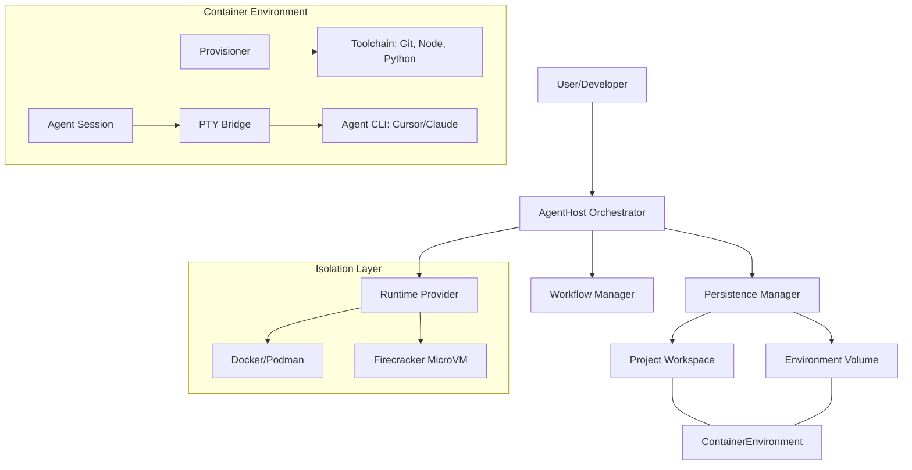

# Architecture Design Document: AI Agent Container Host

## 1. Overview
The AI Agent Container Host is a system designed to orchestrate autonomous AI agents (e.g., Cursor Agent CLI, Claude Code) within isolated environments. It solves the "trust" problem by allowing agents to execute code, install tools, and manage files within a sandbox while maintaining a seamless developer experience.

## 2. System Architecture

### 2.1 High-Level Component Diagram

### 2.2 Component Responsibilities

#### A. AgentHost (The Brain)
The central orchestrator. It coordinates the sequence of parsing the manifest, setting up storage, launching the container, provisioning tools, and establishing the interactive session.

#### B. Runtime Provider (The Sandbox)
A pluggable interface that abstracts the underlying virtualization technology.
- **Docker/Podman**: Uses Linux namespaces/cgroups for lightweight isolation.
- **Firecracker**: Uses KVM-based MicroVMs for hardware-level isolation.

#### C. Workflow Manager (The Spec)
Handles the `WorkflowManifest`. It ensures that the requested agent type and toolchain are validated and mapped to the container configuration.

#### D. Provisioner (The Setup)
Executes the "last-mile" configuration inside the running container. It installs the specified `systemPackages`, `npmPackages`, and `pythonPackages` and runs custom setup scripts before the agent is activated.

#### E. Persistence Manager (The Memory)
Implements the **Dual-Layer Persistence** model:
- **Project Layer**: A bind-mount (or virtio-fs) that maps the host's source code to `/workspace`.
- **Environment Layer**: A named volume (or block device) mapped to `/home/agent` to persist tool caches and session state.

#### F. PTY Bridge (The Interface)
Since AI agents are highly interactive, a standard `exec` call is insufficient. The bridge uses `node-pty` to create a pseudo-terminal, allowing the host to send input and receive formatted ANSI output exactly as a human would in a terminal.

## 3. Data Flow

### 3.1 Launch Sequence
1. **Request**: User provides a Manifest $\rightarrow$ `AgentHost`.
2. **Analysis**: `WorkflowManager` validates the spec $\rightarrow$ `AgentHost`.
3. **Storage**: `PersistenceManager` prepares the workspace and env volume $\rightarrow$ `RuntimeProvider`.
4. **Creation**: `RuntimeProvider` spawns the container with mounts and env vars $\rightarrow$ `ContainerId`.
5. **Provisioning**: `Provisioner` runs `apt/npm/pip` installs inside the container.
6. **Interaction**: `AgentSession` opens a PTY channel via `PtyBridge` $\rightarrow$ `Agent CLI`.

## 4. Design Trade-offs

| Feature | Decision | Trade-off |
| :--- | :--- | :--- |
| **Runtime** | Pluggable Strategy | Increased complexity in the provider interface to gain flexibility between speed (Docker) and security (Firecracker). |
| **Tooling** | Just-in-Time Provisioning | Slower initial startup compared to pre-baked images, but allows for highly dynamic "Pluggable Workflows". |
| **Persistence** | Dual-Layer | Separate storage for code and state prevents "polluting" the project git repo with agent caches and config. |
| **Interface** | PTY Bridge | Requires native build dependencies (`node-pty`), but essential for the interactive nature of AI Agents. |
